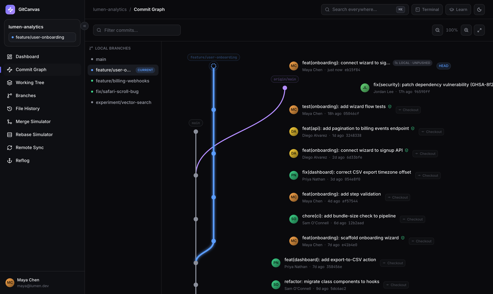
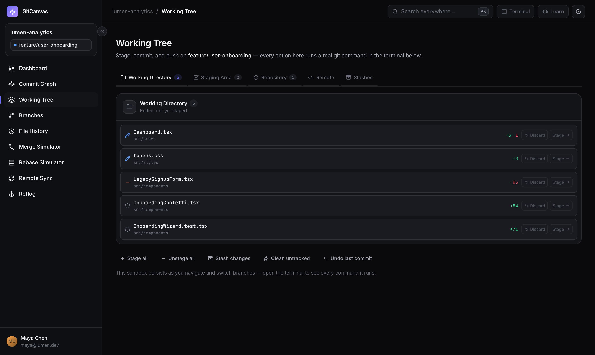
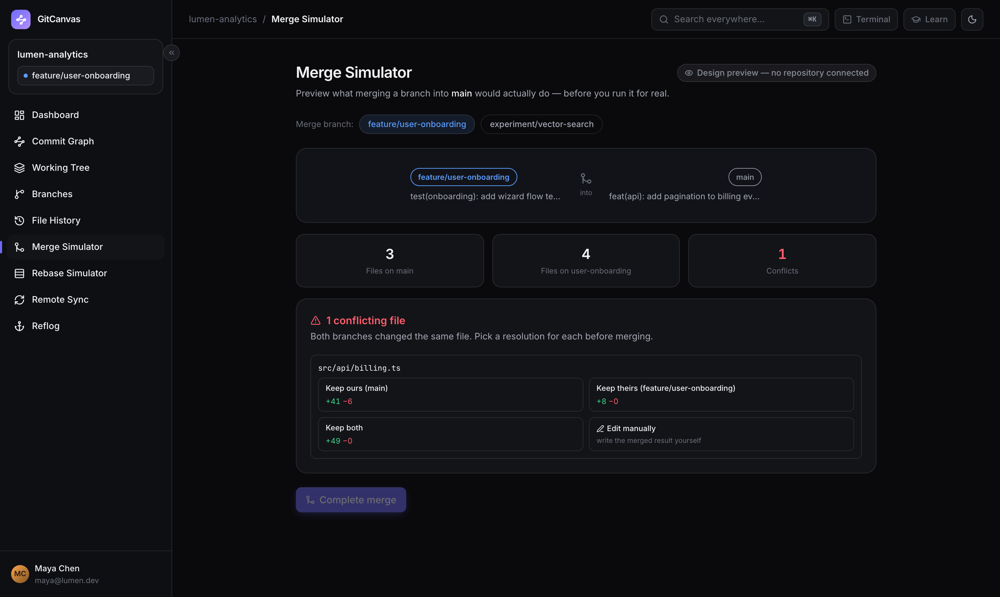

# GitCanvas

**See what Git is thinking.** An interactive, beginner-friendly view of your real repository — a spatial commit graph, a working-tree pipeline, merge/rebase simulators, reflog, and blame — right inside VS Code. Every button runs a **real git command** and shows you exactly what it ran, so you learn git while you use it.

## Why GitCanvas

Git is easy to *use* and hard to *understand*. GitCanvas is built for the moment someone asks "but what did that actually do?":

- **Every GUI action executes real git** (`git add`, `git commit`, `git stash push -u`, `git rebase`, …) and the built-in terminal panel shows the exact command plus git's real output — not a scripted approximation.
- **Honest teaching.** The simulations match git's true behavior, including the classics that trip beginners up: `reset --hard` leaves untracked files alone, `stash pop` restores your changes *unstaged*, unstaging before your first commit uses `git rm --cached` because there's no HEAD yet.
- **Educational notes everywhere** explain the *what* and the *why*, with the underlying command for each view.

## Features

- **Commit Graph** — commits, branches, and merges laid out spatially with time-based lane reuse (like `git log --graph`, but readable). Click any line to trace it; checkout any commit from the row.
- **Working Tree pipeline** — Working Directory → Staging → Repository → Remote → Stashes as one flow. Stage, unstage, discard, stash, commit, amend, push.
- **Clone from the GUI** — paste a URL, pick a folder, done. No repo open? GitCanvas offers to clone or init right there.
- **Merge & Rebase simulators** — watch what a merge or rebase *will* do, including conflicts, then run it for real with a per-file resolve → continue/abort flow.
- **Remote Sync** — fetch / pull / push / force-with-lease with ahead/behind made visible.
- **Reflog** — the "undo history" of your repo, for the day a reset seems to have eaten your work.
- **File History & Blame** — a file's lifeline across renames, and per-line attribution.

## Getting started

1. Install the extension.
2. Open any git repository (or let GitCanvas clone one for you).
3. Run **“GitCanvas: Open”** from the Command Palette, or click the GitCanvas icon in the Activity Bar.

## Safety

- All git invocations use argument arrays (never a shell), so file names and messages can't be interpreted as shell syntax.
- Destructive actions (`reset --hard`, `clean`, force-push) sit behind explicit two-step confirmations, and force-push uses `--force-with-lease`.
- Conflict-prone operations (merge, revert, cherry-pick) open a real resolve flow; rebase auto-aborts on failure rather than leaving the repo half-applied.

## Contributing

Issues and PRs welcome — this project is young and moving fast. See the repo for development setup (`npm install`, `npm test` runs the full suite against real throwaway repositories).

## License

MIT
